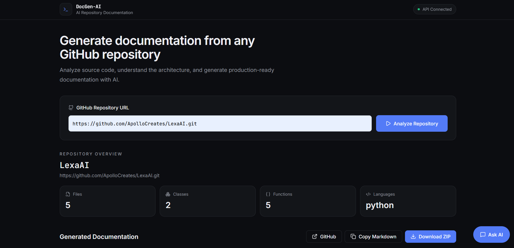
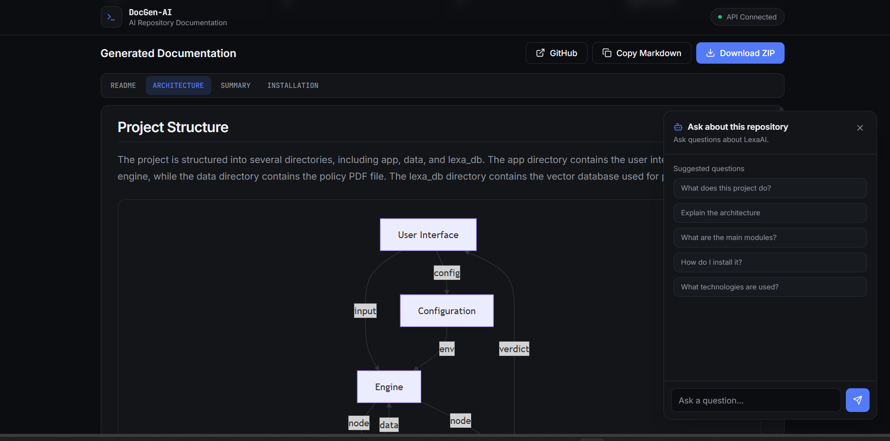

# DocGen-AI

> AI-powered GitHub repository analyzer and technical documentation generator.

DocGen-AI analyzes a GitHub repository, reverse-engineers its structure,
and generates detailed technical documentation using static analysis,
structured repository knowledge, and LLM-based reasoning.

Instead of simply sending raw repository files to an LLM, DocGen-AI first
analyzes the codebase to extract meaningful information about its structure,
modules, dependencies, frameworks, classes, functions, and execution flow.

The extracted knowledge is then provided to an AI documentation agent that
generates repository-specific technical documentation.

## Preview

### Repository Analysis

DocGen-AI accepts a GitHub repository URL and analyzes the codebase
automatically.

### Generated Architecture

The architecture documentation includes an automatically generated
Mermaid diagram representing the major components and relationships
identified in the repository.

## Overview

Understanding an unfamiliar codebase can be time-consuming, especially
when documentation is incomplete, outdated, or missing entirely.

DocGen-AI automates this process by analyzing the repository before
using an LLM to generate technical documentation.

The system performs repository-level analysis to extract information such
as:

- Source files and modules
- Imports
- Classes
- Functions
- API endpoints
- Dependencies
- Frameworks
- Entry points
- Configuration files
- Package managers
- Repository structure
- Repository statistics

This information is converted into a structured repository knowledge
representation and provided to the documentation agent.

The agent then generates four documentation artifacts:

- `README.md`
- `ARCHITECTURE.md`
- `SUMMARY.md`
- `INSTALLATION.md`

## Features

- 🔍 Analyze public GitHub repositories
- 🌳 Repository structure discovery
- 🧩 AST-based source-code parsing
- 📦 Dependency detection
- 🔎 Framework detection
- 🚪 Entry-point discovery
- ⚙️ Configuration-file discovery
- 📋 Package-manager detection
- 🧠 Structured repository knowledge extraction
- 🤖 LLM-powered documentation generation
- 📖 README generation
- 🏗️ Architecture documentation
- 📊 Mermaid architecture diagrams
- 📝 Project summaries
- ⚙️ Installation documentation
- 💬 AI-powered repository chat
- 📈 Repository statistics
- 📋 Markdown document viewer
- 📥 Copy generated Markdown
- 🔗 Open analyzed repository on GitHub
- 📦 Download generated documentation as ZIP

## How It Works

DocGen-AI uses a staged repository-analysis pipeline.

GitHub Repository
       │
       ▼
┌──────────────────┐
│ Clone Repository │
└────────┬─────────┘
         ▼
┌──────────────────┐
│ Repository Scan  │
└────────┬─────────┘
         ▼
┌──────────────────┐
│ AST Parsing      │
└────────┬─────────┘
         ▼
┌──────────────────────────┐
│ Repository Discovery     │
│                          │
│ Dependencies             │
│ Frameworks               │
│ Entry Points             │
│ Configuration            │
│ Package Manager          │
└────────┬─────────────────┘
         ▼
┌──────────────────────────┐
│ Knowledge Builder        │
│                          │
│ Modules                  │
│ Classes                  │
│ Functions                │
│ Imports                  │
│ Endpoints                │
│ Repository Tree          │
│ Statistics               │
└────────┬─────────────────┘
         ▼
┌──────────────────────────┐
│ Documentation Agent      │
│                          │
│ Structured Context + LLM │
└────────┬─────────────────┘
         ▼
┌──────────────────────────┐
│ Generated Documentation  │
│                          │
│ README                   │
│ Architecture             │
│ Summary                  │
│ Installation             │
└──────────────────────────┘

---

## 6. Architecture

## Architecture

DocGen-AI is organized around a backend pipeline responsible for
repository analysis and an interactive frontend responsible for presenting
the generated documentation.

### Backend Pipeline

                    RepositoryPipeline
                           │
        ┌──────────────────┼──────────────────┐
        │                  │                  │
        ▼                  ▼                  ▼
   CloneStage          ScanStage         ParseStage
                                             │
                                             ▼
                                       IndexStage
                                             │
                                             ▼
                                  DocumentationStage
                                             │
                                             ▼
                                  DocumentationAgent
                                             │
                                             ▼
                                            LLM
                                             │
                                             ▼
                                  Generated Documents

---

## 7. Mermaid Architecture

### Generated Architecture Diagram

DocGen-AI automatically generates a Mermaid architecture diagram as part
of the architecture documentation.

The diagram is generated from the repository information available during
analysis rather than being manually defined for a specific project.

Example:

flowchart TD
    USER["User"]
    UI["Web Interface"]
    API["FastAPI API"]
    PIPELINE["Repository Pipeline"]
    PARSER["Source Parser"]
    DISCOVERY["Repository Discovery"]
    KNOWLEDGE["Knowledge Builder"]
    AGENT["Documentation Agent"]
    LLM["LLM"]
    OUTPUT["Generated Documentation"]

    USER --> UI
    UI --> API
    API --> PIPELINE
    PIPELINE --> PARSER
    PIPELINE --> DISCOVERY
    PARSER --> KNOWLEDGE
    DISCOVERY --> KNOWLEDGE
    KNOWLEDGE --> AGENT
    AGENT --> LLM
    LLM --> OUTPUT

---

## 8. Generated Documentation

## Generated Documentation

For every analyzed repository, DocGen-AI generates four documentation
artifacts.

### README.md

Provides a developer-friendly overview of the repository including:

- Project purpose
- Key features
- Architecture
- Project structure
- Technology stack
- Important modules
- Installation
- Configuration
- Usage
- Execution workflow

### ARCHITECTURE.md

Provides a deeper technical analysis including:

- Architecture overview
- High-level design
- Project structure
- Execution flow
- Data flow
- Module relationships
- AI/ML components
- Storage and data layer
- External services
- Technologies used
- Mermaid architecture diagram

### SUMMARY.md

Provides a concise technical overview containing:

- Project purpose
- Main functionality
- Core components
- Technologies
- Important modules
- High-level workflow
- Inputs and outputs

### INSTALLATION.md

Provides practical repository-specific setup instructions based on the
information discovered during repository analysis.

This can include:

- Prerequisites
- Dependencies
- Installation commands
- Environment variables
- Configuration
- Running the application
- Development setup

## Tech Stack

### Backend

- **Python** — Core backend and analysis logic
- **FastAPI** — REST API
- **Pydantic** — Data validation and structured models
- **Tree-sitter** — Source-code parsing
- **uv** — Python dependency and environment management
- **pytest** — Automated testing

### AI

- **Groq API** — LLM inference
- **LLM-based agents** — Documentation and repository question answering

### Frontend

- **React** — User interface
- **TypeScript** — Type-safe frontend development
- **Vite** — Frontend development and build tooling
- **TanStack Router** — Routing
- **Tailwind CSS** — Styling
- **shadcn/ui** — UI components
- **React Markdown** — Markdown rendering
- **Mermaid** — Architecture diagram rendering

## Project Structure

docgen-ai/
│
├── backend/
│   ├── app/
│   │   ├── agents/
│   │   │   ├── base.py
│   │   │   ├── documentation.py
│   │   │   └── chat.py
│   │   │
│   │   ├── analyzer/
│   │   ├── api/
│   │   ├── discovery/
│   │   ├── knowledge/
│   │   ├── mapper/
│   │   ├── parser/
│   │   ├── pipeline/
│   │   ├── prompts/
│   │   ├── services/
│   │   └── utils/
│   │
│   └── tests/
│
└── frontend/
    └── repo-explainer-ai/
        └── src/
            ├── components/
            │   ├── docgen/
            │   └── ui/
            │
            ├── hooks/
            ├── lib/
            └── routes/

---

## 11. Important Backend Components

## Important Components

### Repository Pipeline

The repository pipeline coordinates the different stages involved in
analyzing a GitHub repository.

The stages progressively transform a repository URL into structured
repository knowledge and generated documentation.

### Parser

The parser extracts source-code structures such as:

- Imports
- Classes
- Functions
- API endpoints

For Python repositories, the parser uses Tree-sitter and visitor-based
components to extract these symbols.

### Discovery

The discovery system identifies repository-level information including:

- Dependencies
- Frameworks
- Entry points
- Configuration files
- Package managers

### Knowledge Builder

The Knowledge Builder combines parser and discovery results into a
`RepositoryKnowledge` model.

The resulting knowledge contains information about:

- Languages
- Frameworks
- Dependencies
- Entry points
- Configuration
- Repository tree
- Statistics
- Modules
- Classes
- Functions
- Imports

### Documentation Agent

The Documentation Agent converts the structured repository knowledge into
a prompt and sends it to the LLM.

The response is validated and converted into the four generated
documentation artifacts.

Mermaid syntax is also sanitized before the architecture document is
returned to the frontend.

### Chat Agent

The chat functionality allows users to ask questions about the analyzed
repository using the repository context available to the backend.

## Getting Started

### Prerequisites

Make sure the following tools are installed:

- Python 3.12
- Node.js
- Git
- uv
- npm

You will also need an API key for the configured LLM provider.

### Backend Setup

cd backend

uv sync
